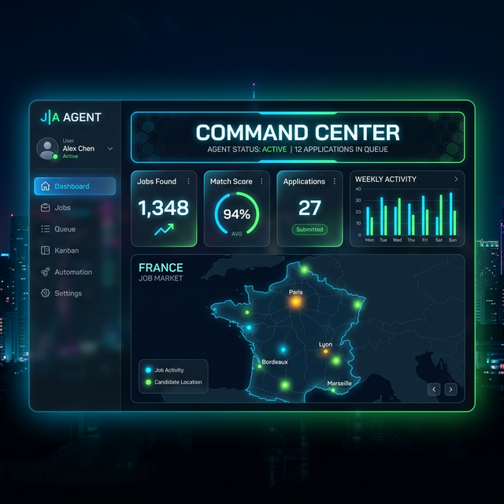

# ⚡️ Agentic-Job-Mission-Control (Orbital v3.0)

> **The first high-frequency, agentic job application engine designed specifically for the French, Indian, and Global tech markets.**



[](https://github.com/Daaksh05/Agentic-Job-Mission-Control)
[](https://github.com/Daaksh05/Agentic-Job-Mission-Control)
[](https://github.com/Daaksh05/Agentic-Job-Mission-Control)
[](https://github.com/Daaksh05/Agentic-Job-Mission-Control)

---

> [!IMPORTANT]
> **SYSTEM STATUS: WORK IN PROGRESS**
> This project is currently in active development. The core "Orbital" engine, "Command Center" UI, and AI document generation are fully operational. Advanced modules like LinkedIn Easy Apply automation and depth-scoring are still being refined. Expected v1.0 stable release: May 2026.

---

## 🚀 The Mission
**Agentic-Job-Mission-Control** is not just a scraper; it's an autonomous "Human-in-the-loop" application pipeline. It handles everything from discovery on niche French and Indian job boards to generating AI-tailored resumes and cover letters, and performing automated, browser-based submissions with CAPTCHA-solved overrides.

### 🧠 Core Intelligence
- **High-Frequency Discovery**: Real-time monitoring of LinkedIn, Welcome to the Jungle, Adzuna (France & India), Remotive, and Civiweb (VIE Missions).
- **AI-Tailored Identity**: Dynamic resume optimization powered by **Gemini 2.0 Flash Lite** with **Groq (Llama 3)** fallback. Generates formal French (Vous) cover letters and professional English resumes.
- **Autopilot Submissions**: Playwright-powered browser automation for Greenhouse, Lever, Workday, and generic job boards. Includes smart **interstitial handling** (auto-closes cookie banners, popups) and **job board redirection** (navigates from Adzuna to the employer's ATS).
- **Intelligence Dashboard**: A premium "Mission Control" UI with real-time analytics, Kanban tracking, and follow-up alerts.
- **Bot Telemetry**: Instant alerts via Telegram for every discovery, submission, interview, and offer event.
- **Regional Discovery**: Supports India 🇮🇳, France 🇫🇷, UK 🇬🇧, Germany 🇩🇪, Netherlands 🇳🇱, and Remote markets.
- **PDF Resume Support**: Upload professional PDF resumes with automatic text extraction for AI tailoring.

## ✨ What's New in v3.0

| Feature | Description |
| :--- | :--- |
| **Gemini 2.0 Flash Lite** | Ultra-fast AI document generation (< 10 seconds per application) |
| **Triple-Layer AI Resilience** | Gemini → Groq fallback with exponential backoff retries |
| **India Market Discovery** | 140+ software engineering roles indexed from the Indian market |
| **VIE Mission Tracker** | Live mission sync with 35+ engineering missions from Civiweb |
| **Autopilot Interstitial Handler** | Automatically closes cookie banners, email popups, and modals |
| **Job Board Redirection** | Navigates from Adzuna landing pages to the actual ATS forms |
| **WebSocket Status Stream** | Real-time Autopilot progress updates in the UI |
| **Async AI Processing** | Non-blocking AI calls prevent backend hangs |

## 🛠 High-Performance Stack
- **Frontend**: React 18, Vite, TanStack Query, Framer Motion, Tailwind CSS, Lucide Icons.
- **Backend**: FastAPI (Python 3.9+), SQLAlchemy, SQLite, APScheduler.
- **Automation**: Playwright (Headless/Headful with CAPTCHA Override support).
- **AI Engine**: Google Gemini 2.0 Flash Lite (Primary) & Groq Llama 3 (Fallback).
- **Real-time**: WebSocket status streaming for live Autopilot telemetry.
- **Notifications**: Telegram Bot for instant mission alerts.

## 🛰 Project Architecture
```bash
├── backend/                # FastAPI Core Engine
│   ├── agents/             # Autonomous Agents (Discovery, Writer, Submitter)
│   │   ├── submitter.py    # Autopilot: ATS form filling + interstitial handler
│   │   ├── writer.py       # AI document generation agent
│   │   └── vie_discovery.py # VIE mission scanner (Civiweb)
│   ├── api/                # High-frequency REST + WebSocket endpoints
│   ├── models/             # SQLite Mission Database
│   └── services/           # AI, WebSocket, Telegram, and Scheduler services
│       ├── ai_service.py   # Gemini 2.0 + Groq fallback engine
│       ├── job_service.py  # Multi-market job discovery
│       └── websocket_service.py # Real-time status streaming
├── frontend/               # React Command Center
│   ├── src/pages/          # Dashboard, Kanban, Intelligence Feed, Queue, Analytics
│   └── src/components/     # Premium Glassmorphism UI Components
└── .env                    # Mission Variables (API Keys, Bot Tokens)
```

## 🛠 Setup & Launch

1. **Clone the Manifest**:
   ```bash
   git clone https://github.com/Daaksh05/Agentic-Job-Mission-Control.git
   cd Agentic-Job-Mission-Control
   ```

2. **Configure Environment** (create `backend/.env`):
   ```env
   GEMINI_API_KEY=your_gemini_key
   GROQ_API_KEY=your_groq_key
   ADZUNA_APP_ID=your_adzuna_id
   ADZUNA_APP_KEY=your_adzuna_key
   TELEGRAM_BOT_TOKEN=your_telegram_token
   TELEGRAM_CHAT_ID=your_chat_id
   ```

3. **Fuel the Backend**:
   ```bash
   cd backend
   pip install -r requirements.txt
   python3 main.py
   ```

4. **Ignite the Frontend**:
   ```bash
   cd ../frontend
   npm install
   npm run dev
   ```

## 🌍 Market Strategy
The agent prioritizes the **French Tech Market** and the **Indian Tech Market** while concurrently monitoring secondary targets in the **UK, Germany, Netherlands, Canada, and Remote**. It automatically handles language localization and formal tone requirements for European institutions.

### 🚧 Current Roadmap
- [x] Phase 1: High-speed Discovery on FR/IN/Global boards
- [x] Phase 2: AI Document Tailoring (FR/EN) with Gemini 2.0 + Groq fallback
- [x] Phase 3: Headless browser automation (Lever/Greenhouse/Workday)
- [x] Phase 4: Autopilot interstitial handling & job board redirection
- [x] Phase 5: VIE Mission Tracker (Civiweb integration)
- [x] Phase 6: Telegram Bot telemetry & notifications
- [ ] Phase 7: LinkedIn Easy Apply autonomous handler (In Progress)
- [ ] Phase 8: Deep-tier intelligence for interview coaching

---
*Created by [Daakshayani Senthilkumar](https://ai-engineer-portfolio-jj7pvdk9v-daaksh05s-projects.vercel.app)*
